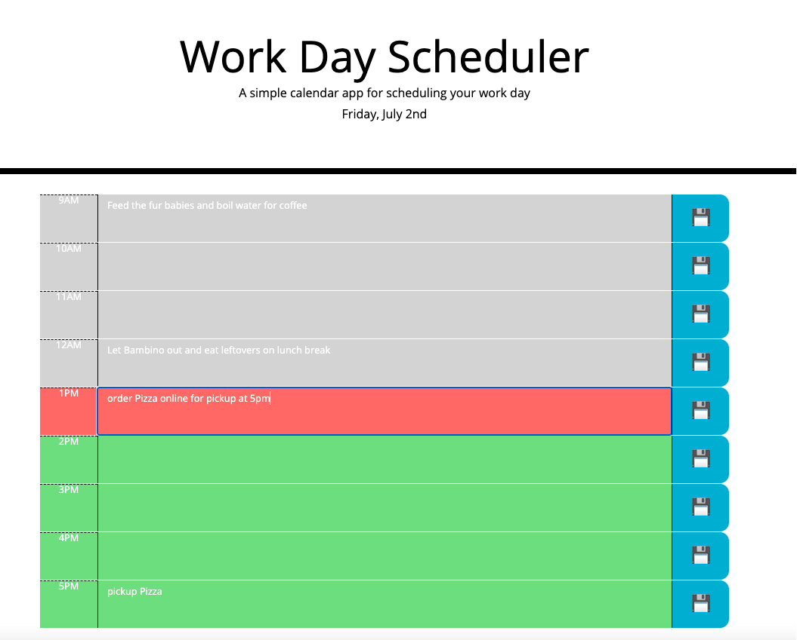

#Work-Day-Scheduler-with-Third-Party-APIs
##Created a simple calendar application that allows a user to save events for each hour of the day by modifying starter code
##This app will run in the browser and feature dynamically updated HTML and CSS powered by jQuery and Moment.js

## Table of Contents

**[Quick Links](#Quick-Links)** 
**[First Looks](#First-Looks)** 
**[Wireframes](#Wireframes)** 
**[Bugs and Known Issues](#Bugs-and-Known-Issues)** 
**[Next Steps to Continue](#Next-Steps-to-Continue)** 
**[Wireframes OR SudoCode of Acceptance Criteria](Wireframes-OR-SudoCode-of-Acceptance-Criteria)** 
**[Acceptance Criteria](#Acceptance-Criteria)** 
**[Bonus](#Bonus)** 
**[Deliverables](#Deliverables)** 
**[License](#License)** 

## Quick Links

- click here to view --> [final website](https://jessamyn27.github.io/Work-Day-Scheduler-with-Third-Party-APIs/)

- click here to view --> [README GUIDE from UT](https://github.com/the-Coding-Boot-Camp-at-UT/UTA-VIRT-FSF-FT-06-2021-U-LOL/blob/master/01-HTML-Git-CSS/02-Homework/Homework-Guide/README.md)

## First Looks

# 

## Bugs and Known Issues

- responsive stacks badly, hard to click save button
- icon a tag wasn't saving to local storage so had to add an emoji inside the parent div, should find a better fix 
- only goes from 9am to 5pm so hard to test outside those hours for moment.js hour functionality 
- colors in acceptance criteria to follow are hard to see and don't follow standard color theory (would change red to green, grey to red and future color to perhaps blue to follow ROYGBIV spectrum red --> violet and green means go/current, red means stop/legacy and blue means pause/future

## Next Steps to Continue

### Next Steps for App UI and Functionality

- hover and click IU needs work
- font color and sizing needs improvement (see above comments on color)
- animation?
- add in buttet points for each item in the text area?
- add in checkboxes and /or remove button for each task in each hour
- change color or size of text for past/present/future for better UI clarity
- padding and display clean up esp on mobile

## Wireframes OR SudoCode of Acceptance Criteria - n/a

## Acceptance Criteria

- GIVEN I am using a daily planner to create a schedule
- WHEN I open the planner
- THEN the current day is displayed at the top of the calendar
- WHEN I scroll down
- THEN I am presented with timeblocks for standard business hours
- WHEN I view the timeblocks for that day
- THEN each timeblock is color coded to indicate whether it is in the past, present, or future
- WHEN I click into a timeblock
- THEN I can enter an event
- WHEN I click the save button for that timeblock
- THEN the text for that event is saved in local storage
- WHEN I refresh the page
- THEN the saved events persist

## Grading Requirements

- This homework is graded based on the following criteria: 

### Technical Acceptance Criteria: 40%

* Satisfies all of the above acceptance criteria.

### Deployment: 32%

* Application deployed at live URL.

* Application loads with no errors.

* Application GitHub URL submitted.

* GitHub repository contains application code.

### Application Quality: 15%

* Application resembles the mock-up functionality provided in the homework instructions.

### Repository Quality: 13%

* Repository has a unique name.

* Repository follows best practices for file structure and naming conventions.

* Repository follows best practices for class/id naming conventions, indentation, quality comments, etc.

* Repository contains multiple descriptive commit messages.

* Repository contains quality readme with description, screenshot, link to deployed application.

## Review

You are required to submit BOTH of the following for review:

* The URL of the deployed application.

* The URL of the GitHub repository that contains your code. Give the repository a unique name and include a README file that describes the project.

### Bonus

- 1. Transpile JS for compatibility with other browsers (Safari/iOS)
- 2. Use of the Airbnb style guide
- 3. Unit tests for critical functions
- 4. Use JSDocs 3 pattern for comments
- 5. Write a list of bugs or known issues for your implementation if needed

### Deliverables

- 1. All source files (ES6 and SCSS)
- 2. HTML and CSS files (unminified)
- 3. GitHub repository link in UT Portal
- 4. Gitpages live website link in UT Portal

### License

[MIT License](https://opensource.org/licenses/MIT)

**[Back Up To Top](#Work-Day-Scheduler-with-Third-Party-APIs)**

